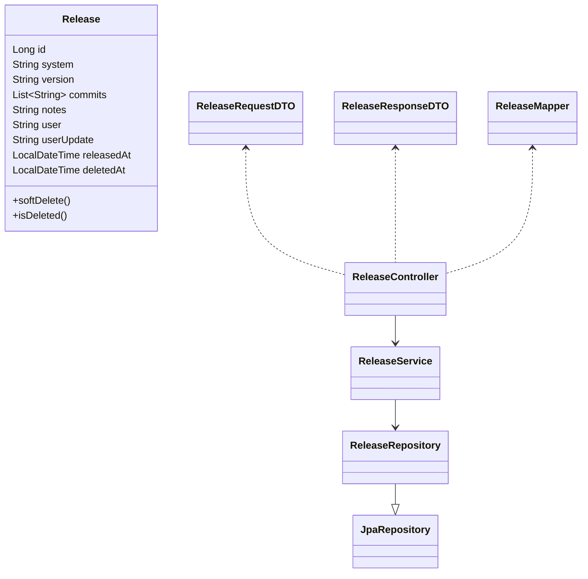

# Gerenciador de Releases – Spring Boot


---

## sumario

- [Descricao](#descricao)
- [Diagrama UML](#diagrama-uml)
- [Estrutura de Pastas e Arquivos](#estrutura-de-pastas-e-arquivos)
- [Rotas da API](#rotas-da-api)
- [Instrucao de Instalacao](#instrucao-de-instalacao)
- [Instrucoes de Uso](#instrucoes-de-uso)
- [Licenca](#licenca)
- [Contribuicao](#contribuicao)
- [Gitflow](#gitflow)
- [Autor](#autor)

---

## descricao

Aplicacao RESTful API para o controle e versionamento de releases de software, provendo historico, rastreabilidade e seguranca das operacoes.

- Permite cadastrar, consultar, atualizar notas e deletar (soft delete) releases de diferentes sistemas.
- Cada release possui versionamento, commits vinculados, usuario responsavel, timestamps de criacao e atualizacao.
- API robusta, validada, documentada e pronta para uso profissional.

---

## diagrama-uml



---

## estrutura-de-pastas-e-arquivos

| Caminho/Arquivo                                    | O que faz                                    |
| -------------------------------------------------- | -------------------------------------------- |
| `src/main/java/releases/ReleasesApplication.java`  | Classe main: Inicia o Spring Boot            |
| `controller/ReleaseController.java`                | Exposicao dos endpoints REST da API          |
| `service/ReleaseService.java`                      | Logica de negocios e orquestracao            |
| `model/entity/Release.java`                        | Entidade JPA que representa a tabela release |
| `model/repository/ReleaseRepository.java`          | Interface JPA para acesso ao banco de dados  |
| `view/dto/ReleaseRequestDTO.java`                  | DTO dos dados recebidos para criar release   |
| `view/dto/ReleaseResponseDTO.java`                 | DTO dos dados retornados para o cliente      |
| `view/mapper/ReleaseMapper.java`                   | Conversao entre entity e DTOs                |
| `service/exception/GlobalExceptionHandler.java`    | Handler global de erros e validacoes         |
| `resources/application.yaml`                       | Configuracoes: H2, Spring, Logging           |
| `test/java/releases/ReleasesApplicationTests.java` | Testes base (unit e integracao)              |
| `pom.xml`                                          | Dependencias e configuracao do projeto       |

---

## rotas-da-api

### POST /releases — Criar uma nova release

- Descricao: Cria uma release com system, version, commits, notas e usuario.
- Body Exemplo:

```json
{
  "system": "Portal RH",
  "version": "1.0.0",
  "commits": ["feat: tela RH", "fix: login"],
  "notes": "Primeiro release RH",
  "user": "ana.oliveira"
}
```

- Resposta (201 Created):

```json
{
  "id": 1,
  "message": "Release criado com sucesso."
}
```

- Regras: Preencha todos os campos, exceto notes (opcional). O campo Authorization deve conter o token JWT.

---

### GET /releases/{id} — Detalhar release

- Descricao: Retorna todos os detalhes de uma release especifica pelo ID.
- Resposta (200 OK):

```json
{
  "message": "Release listado com sucesso.",
  "id": 1,
  "system": "Portal RH",
  "version": "1.0.0",
  "commits": ["feat: tela RH", "fix: login"],
  "notes": "Primeiro release RH",
  "user": "ana.oliveira",
  "userUpdate": "ana.oliveira",
  "releasedAt": "2025-05-26T14:00:00Z"
}
```

- Regras: O release deve existir e nao pode estar deletado (soft delete).

---

### PUT /releases/{id} — Atualizar as notas de uma release

- Descricao: Permite atualizar apenas o campo notes de uma release especifica.
- Body Exemplo:

```json
{
  "notes": "Notas atualizadas deste release."
}
```

- Resposta (200 OK):

```json
{
  "message": "Release atualizado com sucesso."
}
```

- Regras: Requer autorizacao, so atualiza notes.

---

### DELETE /releases/{id} — Deletar logicamente uma release

- Descricao: Apaga uma release de forma logica (soft delete, campo deletedAt).
- Resposta (200 OK):

```json
{
  "message": "Release deletado com sucesso."
}
```

- Regras: O release continuara salvo no banco, apenas marcado como deletado.

---

## instrucao-de-instalacao

### Pre-requisitos

- Java 17+
- Maven 3.8+
- Git 2.4+
- (Opcional) Postman, Insomnia, HTTPie, etc.

```bash
git clone https://github.com/seuusuario/repo-releases-springboot.git
cd releases
./mvnw clean install
```

Ou tradicional:

```bash
mvn clean install
```

---

## instrucoes-de-uso

1. Suba a aplicacao:

   ```bash
   ./mvnw spring-boot:run
   ```

   Ou:

   ```bash
   java -jar target/releases-*.jar
   ```

2. Acesse a documentação do Swagger [http://localhost:8080/swagger-ui.html](http://localhost:8080/swagger-ui.html)
3. Principais rotas:
   - POST /releases – criar release
   - GET /releases/{id} – detalhar release
   - PUT /releases/{id} – atualizar notas da release
   - DELETE /releases/{id} – apagar logicamente
4. Banco H2 (debug): [http://localhost:8080/h2-console](http://localhost:8080/h2-console)
   (JDBC: jdbc:h2:mem:releases, User: sa)

---

## licenca

Projeto sob Licenca MIT (totalmente livre para uso comercial, estudo, adaptacao e inspiracao).

---

## contribuicao

- Issues e Pull Requests sao bem-vindos!
- Sempre use branch com padrao (feature/, hotfix/, bugfix/)
- Descreva claramente sua alteracao e mantenha o padrao de qualidade.

---

## gitflow

- Crie branches com prefixos:
  - feature/NOME_DA_FEATURE
  - bugfix/NOME_DO_BUG
  - hotfix/CORRECAO
- Pull Requests devem ser feitos para o branch main.
- Utilize nomes descritivos e documente mudancas relevantes.

---

## autor

- [Darieldon Medeiros](https://github.com/DarieldonMedeiros)
