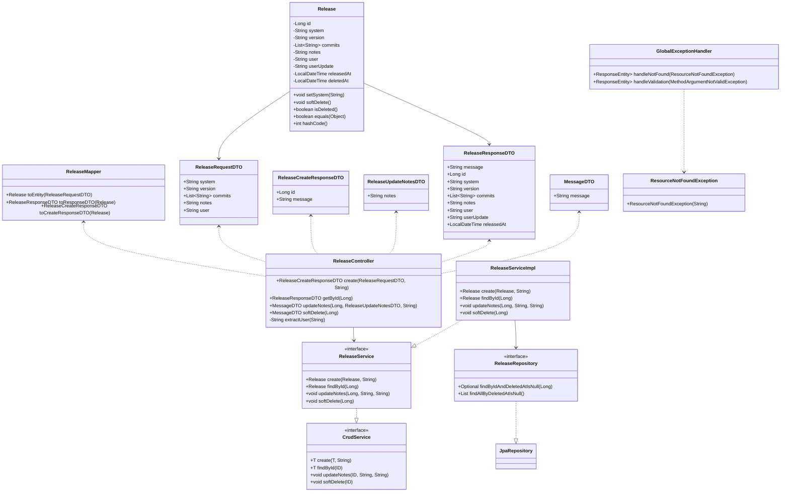

# Gerenciador de Releases – Spring Boot


---

## 📖 Sumário

- [📄 Descrição](#-descrição)
- [🎨 Diagrama UML](#-diagrama-uml)
- [🗂️ Organanização das Pastass](#%EF%B8%8F-organização-das-pastas)
- [🚦 Rotas da API](#-rotas-da-api)
- [🛠️ Instrução de Instalação](#%EF%B8%8F-instrução-de-instalação)
- [▶️ Instruções de Uso](#%EF%B8%8F-instruções-de-uso)
- [📝 Licença](#-licença)
- [👤 Autor](#-autor)

---

## 📄 Descrição

Aplicacao RESTful API para o controle e versionamento de releases de software, provendo historico, rastreabilidade e seguranca das operacoes.

- Permite cadastrar, consultar, atualizar notas e deletar (soft delete) releases de diferentes sistemas.
- Cada release possui versionamento, commits vinculados, usuario responsavel, timestamps de criacao e atualizacao.
- API robusta, validada, documentada e pronta para uso profissional.

---

## 🎨 Diagrama UML


---

## 🗂️ Organização das Pastas

```bash
.
├── releases
│   ├── ReleasesApplication.java
│   ├── controller
│   │   └── ReleaseController.java
│   ├── model
│   │   ├── entity
│   │   │   └── Release.java
│   │   └── repository
│   │       └── ReleaseRepository.java
│   ├── service
│   │   ├── CrudService.java
│   │   ├── ReleaseService.java
│   │   ├── impl
│   │   │   └── ReleaseServiceImpl.java
│   │   └── exception
│   │       ├── GlobalExceptionHandler.java
│   │       └── ResourceNotFoundException.java
│   └── view
│       ├── dto
│       │   ├── MessageDTO.java
│       │   ├── ReleaseCreateResponseDTO.java
│       │   ├── ReleaseRequestDTO.java
│       │   ├── ReleaseResponseDTO.java
│       │   └── ReleaseUpdateNotesDTO.java
│       └── mapper
│           └── ReleaseMapper.java
```

---

## 🚦 Rotas da API

### POST /releases — Criar uma nova release

- Descricao: Cria uma release com system, version, commits, notas e usuario.
- Body Exemplo:

```json
{
  "system": "Portal RH",
  "version": "1.0.0",
  "commits": ["feat: tela RH", "fix: login"],
  "notes": "Primeiro release RH",
  "user": "ana.oliveira"
}
```

- Resposta (201 Created):

```json
{
  "id": 1,
  "message": "Release criado com sucesso."
}
```

- Regras: Preencha todos os campos, exceto notes (opcional). O campo Authorization deve conter o token JWT.

---

### GET /releases/{id} — Detalhar release

- Descricao: Retorna todos os detalhes de uma release especifica pelo ID.
- Resposta (200 OK):

```json
{
  "message": "Release listado com sucesso.",
  "id": 1,
  "system": "Portal RH",
  "version": "1.0.0",
  "commits": ["feat: tela RH", "fix: login"],
  "notes": "Primeiro release RH",
  "user": "ana.oliveira",
  "userUpdate": "ana.oliveira",
  "releasedAt": "2025-05-26T14:00:00Z"
}
```

- Regras: O release deve existir e nao pode estar deletado (soft delete).

---

### PUT /releases/{id} — Atualizar notas de uma release

- Descricao: Permite atualizar apenas o campo notes de uma release especifica.
- Body Exemplo:

```json
{
  "notes": "Notas atualizadas deste release."
}
```

- Resposta (200 OK):

```json
{
  "message": "Release atualizado com sucesso."
}
```

- Regras: Requer autorizacao, so atualiza notes.

---

### DELETE /releases/{id} — Deletar logicamente uma release

- Descricao: Apaga uma release de forma logica (soft delete, campo deletedAt).
- Resposta (200 OK):

```json
{
  "message": "Release deletado com sucesso."
}
```

- Regras: O release continuara salvo no banco, apenas marcado como deletado.

---

## 🛠️ Instrução de Instalação

### Pre-requisitos

- Java 17+
- Maven 3.8+
- Git 2.4+
- (Opcional) Postman, Insomnia, HTTPie, etc.

```bash
git clone https://github.com/seuusuario/repo-releases-springboot.git
cd releases
./mvnw clean install
```

Ou tradicional:

```bash
mvn clean install
```

---

## ▶️ Instruções de Uso

1. Suba a aplicacao:

   ```bash
   ./mvnw spring-boot:run
   ```

   Ou:

   ```bash
   java -jar target/releases-*.jar
   ```

2. Acesse a documentação do Swagger [http://localhost:8080/swagger-ui.html](http://localhost:8080/swagger-ui.html)
3. Principais rotas:
   - POST /releases – criar release
   - GET /releases/{id} – detalhar release
   - PUT /releases/{id} – atualizar notas da release
   - DELETE /releases/{id} – apagar logicamente
4. Banco H2 (debug): [http://localhost:8080/h2-console](http://localhost:8080/h2-console)
   (JDBC: jdbc:h2:mem:releases, User: sa)

---

## 📝 Licença

Projeto sob Licenca MIT (totalmente livre para uso comercial, estudo, adaptacao e inspiracao).

---

## 👤 Autor

- [Darieldon Medeiros](https://github.com/DarieldonMedeiros)

---
