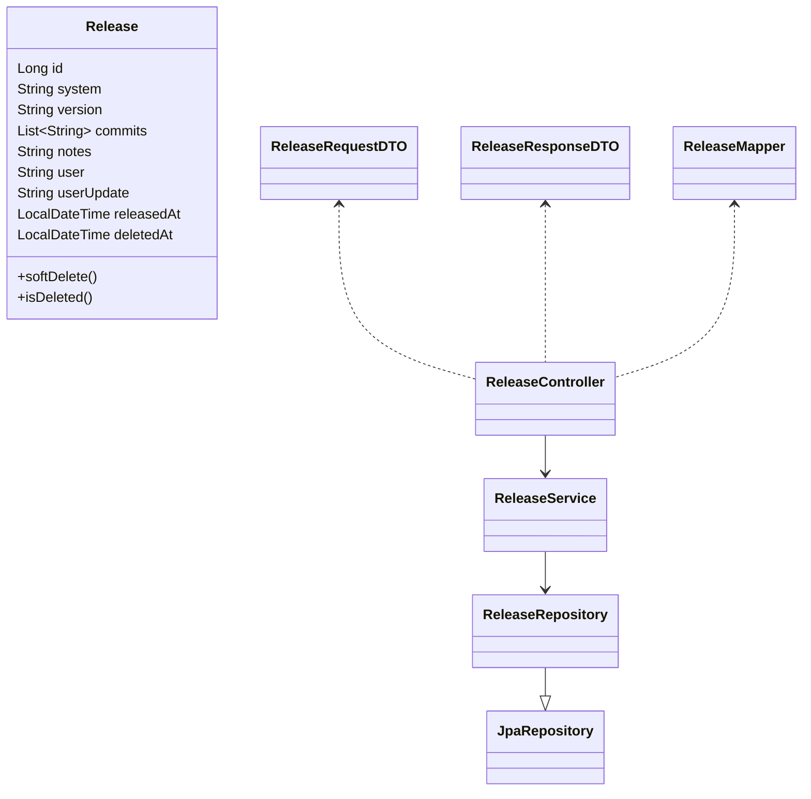

# 🚀 Gerenciador de Releases – Spring Boot


---

## 📖 Sumário

- [Descrição](#descricao)
- [Diagrama UML](#diagrama-uml)
- [Estrutura de Pastas e Arquivos](#estrutura-de-pastas-e-arquivos)
- [Rotas da API](#rotas-da-api)
- [Instalacao](#instrucao-de-instalacao)
- [Uso](#instrucoes-de-uso)
- [Licenca](#licenca)
- [Contribuicao](#contribuicao)
- [Gitflow](#gitflow)
- [Autor](#autor)

---

## 📝 Descrição

Aplicação **RESTful API** para o controle e versionamento de releases (entregas) de software, provendo histórico, rastreabilidade e segurança das operações.

- Permite **cadastrar, consultar, atualizar notas e deletar (soft delete)** releases de diferentes sistemas.
- Cada release possui versionamento, commits vinculados, usuário responsável, timestamps de criação e atualização.
- API robusta, validada, documentada e pronta para uso profissional.

---

## 🎨 Diagrama UML (Simplificado)



> **Nota:** Veja na documentação Swagger códigos e exemplos de payload.

---

## 🗂️ Estrutura de Pastas e Arquivos (Principais)

| Caminho/Arquivo                                    | O que faz                                      |
| -------------------------------------------------- | ---------------------------------------------- |
| `src/main/java/releases/ReleasesApplication.java`  | Classe main: Inicia o Spring Boot              |
| `controller/ReleaseController.java`                | Exposição dos endpoints REST da API            |
| `service/ReleaseService.java`                      | Lógica de negócios e orquestração              |
| `model/entity/Release.java`                        | Entidade JPA que representa a tabela `release` |
| `model/repository/ReleaseRepository.java`          | Interface JPA para acesso ao banco de dados    |
| `view/dto/ReleaseRequestDTO.java`                  | DTO dos dados recebidos para criar release     |
| `view/dto/ReleaseResponseDTO.java`                 | DTO dos dados retornados para o cliente        |
| `view/mapper/ReleaseMapper.java`                   | Conversão entre entity e DTOs                  |
| `service/exception/GlobalExceptionHandler.java`    | Handler global de erros e validações           |
| `resources/application.yaml`                       | Configurações: H2, Spring, Logging             |
| `test/java/releases/ReleasesApplicationTests.java` | Testes base (unit e integração)                |
| `pom.xml`                                          | Dependências e configuração do projeto         |

---

## 🌐 Rotas da API (Endpoints)

### 📦 `POST /releases` — Criar uma nova release

- **Descrição**: Cria uma release com system, version, commits, notas e usuário.
- **Body Exemplo**:

```json
{
  "system": "Portal RH",
  "version": "1.0.0",
  "commits": ["feat: tela RH", "fix: login"],
  "notes": "Primeiro release RH",
  "user": "ana.oliveira"
}
```

- **Resposta** (`201 Created`):

```json
{
  "id": 1,
  "message": "Release criado com sucesso."
}
```

- **Regras**: Preencha todos os campos, exceto `notes` (opcional). O campo `Authorization` deve conter o token JWT.

---

### 🎯 `GET /releases/{id}` — Detalhar release

- **Descrição**: Retorna todos os detalhes de uma release específica pelo ID.
- **Resposta** (`200 OK`):

```json
{
  "message": "Release listado com sucesso.",
  "id": 1,
  "system": "Portal RH",
  "version": "1.0.0",
  "commits": ["feat: tela RH", "fix: login"],
  "notes": "Primeiro release RH",
  "user": "ana.oliveira",
  "userUpdate": "ana.oliveira",
  "releasedAt": "2025-05-26T14:00:00Z"
}
```

- **Regras**: O release deve existir e não pode estar deletado (soft delete).

---

### 📝 `PUT /releases/{id}` — Atualizar as notas de uma release

- **Descrição**: Permite atualizar apenas o campo `notes` de uma release específica.
- **Body Exemplo**:

```json
{
  "notes": "Notas atualizadas deste release."
}
```

- **Resposta** (`200 OK`):

```json
{
  "message": "Release atualizado com sucesso."
}
```

- **Regras**: Requer autorização, só atualiza `notes`.

---

### 🗑️ `DELETE /releases/{id}` — Deletar logicamente uma release

- **Descrição**: Apaga uma release de forma lógica (soft delete, campo `deletedAt`).
- **Resposta** (`200 OK`):

```json
{
  "message": "Release deletado com sucesso."
}
```

- **Regras**: O release continuará salvo no banco, apenas marcado como deletado.

---

## 🚀 Instrução de instalação

### Pré-requisitos

- Java **17+**
- Maven **3.8+**
- Git **2.4+**
- (Opcional) Postman, Insomnia, HTTPie, etc.

```bash
git clone https://github.com/seuusuario/repo-releases-springboot.git
cd releases
./mvnw clean install
```

Ou tradicional:

```bash
mvn clean install
```

---

## ▶️ Instruções de uso

1. **Suba a aplicação:**

   ```bash
   ./mvnw spring-boot:run
   ```

   Ou:

   ```bash
   java -jar target/releases-*.jar
   ```

2. **Acesse a documentação/Swagger:**  
   [http://localhost:8080/swagger-ui.html](http://localhost:8080/swagger-ui.html)

3. **Principais rotas:**

   - `POST /releases` – criar release
   - `GET /releases/{id}` – detalhar release
   - `PUT /releases/{id}` – atualizar notas da release
   - `DELETE /releases/{id}` – apagar logicamente

4. **Banco H2 (debug):**  
   [http://localhost:8080/h2-console](http://localhost:8080/h2-console)  
   (JDBC: `jdbc:h2:mem:releases`, User: `sa`)

---

## 📄 Licença

Projeto sob Licença MIT (totalmente livre para uso comercial, estudo, adaptação e inspiração).

---

## 🤝 Contribuição

- Issues e Pull Requests são bem-vindos!
- Sempre use branch com padrão (`feature/`, `hotfix/`, `bugfix/`)
- Descreva claramente sua alteração e mantenha o padrão de qualidade.

---

## 🔀 Gitflow

- Crie branches com prefixos:
  - `feature/NOME_DA_FEATURE`
  - `bugfix/NOME_DO_BUG`
  - `hotfix/CORRECAO`
- Pull Requests devem ser feitos para o branch `main`.
- Utilize nomes descritivos e documente mudanças relevantes.

---

## 👤 Autor

- [Darieldon Medeiros](https://github.com/DarieldonMedeiros)
