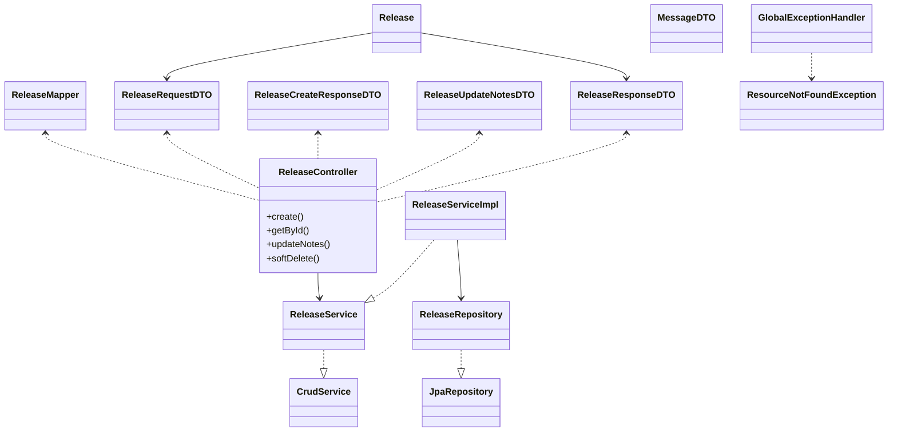

# Gerenciador de Releases – Spring Boot


---

## 📖 sumario

- [📄 Descricao](#-descricao)
- [🎨 Diagrama UML](#-diagrama-uml)
- [🗂️ Estrutura de Pastas e Arquivos](#-estrutura-de-pastas-e-arquivos)
- [🚦 Rotas da API](#-rotas-da-api)
- [🛠️ Instrucao de Instalacao](#-instrucao-de-instalacao)
- [▶️ Instrucoes de Uso](#-instrucoes-de-uso)
- [📝 Licenca](#-licenca)
- [🤝 Contribuicao](#-contribuicao)
- [🔀 Gitflow](#-gitflow)
- [👤 Autor](#-autor)

---

## 📄 descricao

Aplicacao RESTful API para o controle e versionamento de releases de software, provendo historico, rastreabilidade e seguranca das operacoes.

- Permite cadastrar, consultar, atualizar notas e deletar (soft delete) releases de diferentes sistemas.
- Cada release possui versionamento, commits vinculados, usuario responsavel, timestamps de criacao e atualizacao.
- API robusta, validada, documentada e pronta para uso profissional.

---

## 🎨 diagrama-uml



---

## 🗂️ estrutura-de-pastas-e-arquivos

| Caminho/Arquivo                                    | O que faz                                    |
| -------------------------------------------------- | -------------------------------------------- |
| `src/main/java/releases/ReleasesApplication.java`  | Classe main: Inicia o Spring Boot            |
| `controller/ReleaseController.java`                | Exposicao dos endpoints REST da API          |
| `service/ReleaseService.java`                      | Logica de negocios e orquestracao            |
| `service/CrudService.java`                         | Interface generica CRUD                      |
| `service/impl/ReleaseServiceImpl.java`             | Implementacao do servico ReleaseService      |
| `service/exception/GlobalExceptionHandler.java`    | Handler global de erros e validacoes         |
| `service/exception/ResourceNotFoundException.java` | Excecao customizada para nao encontrado      |
| `model/entity/Release.java`                        | Entidade JPA que representa a tabela release |
| `model/repository/ReleaseRepository.java`          | Interface JPA para acesso ao banco de dados  |
| `view/dto/ReleaseRequestDTO.java`                  | DTO dos dados recebidos para criar release   |
| `view/dto/ReleaseResponseDTO.java`                 | DTO dos dados retornados para o cliente      |
| `view/dto/ReleaseCreateResponseDTO.java`           | DTO resposta do POST                         |
| `view/dto/ReleaseUpdateNotesDTO.java`              | DTO para atualizar "notes" via PUT           |
| `view/dto/MessageDTO.java`                         | DTO para mensagens simples                   |
| `view/mapper/ReleaseMapper.java`                   | Conversao entre entity e DTOs                |

---

## 🚦 rotas-da-api

### POST /releases — Criar uma nova release

- Descricao: Cria uma release com system, version, commits, notas e usuario.
- Body Exemplo:

```json
{
  "system": "Portal RH",
  "version": "1.0.0",
  "commits": ["feat: tela RH", "fix: login"],
  "notes": "Primeiro release RH",
  "user": "ana.oliveira"
}
```

- Resposta (201 Created):

```json
{
  "id": 1,
  "message": "Release criado com sucesso."
}
```

- Regras: Preencha todos os campos, exceto notes (opcional). O campo Authorization deve conter o token JWT.

---

### GET /releases/{id} — Detalhar release

- Descricao: Retorna todos os detalhes de uma release especifica pelo ID.
- Resposta (200 OK):

```json
{
  "message": "Release listado com sucesso.",
  "id": 1,
  "system": "Portal RH",
  "version": "1.0.0",
  "commits": ["feat: tela RH", "fix: login"],
  "notes": "Primeiro release RH",
  "user": "ana.oliveira",
  "userUpdate": "ana.oliveira",
  "releasedAt": "2025-05-26T14:00:00Z"
}
```

- Regras: O release deve existir e nao pode estar deletado (soft delete).

---

### PUT /releases/{id} — Atualizar notas de uma release

- Descricao: Permite atualizar apenas o campo notes de uma release especifica.
- Body Exemplo:

```json
{
  "notes": "Notas atualizadas deste release."
}
```

- Resposta (200 OK):

```json
{
  "message": "Release atualizado com sucesso."
}
```

- Regras: Requer autorizacao, so atualiza notes.

---

### DELETE /releases/{id} — Deletar logicamente uma release

- Descricao: Apaga uma release de forma logica (soft delete, campo deletedAt).
- Resposta (200 OK):

```json
{
  "message": "Release deletado com sucesso."
}
```

- Regras: O release continuara salvo no banco, apenas marcado como deletado.

---

## 🛠️ instrucao-de-instalacao

### Pre-requisitos

- Java 17+
- Maven 3.8+
- Git 2.4+
- (Opcional) Postman, Insomnia, HTTPie, etc.

```bash
git clone https://github.com/seuusuario/repo-releases-springboot.git
cd releases
./mvnw clean install
```

Ou tradicional:

```bash
mvn clean install
```

---

## ▶️ instrucoes-de-uso

1. Suba a aplicacao:

   ```bash
   ./mvnw spring-boot:run
   ```

   Ou:

   ```bash
   java -jar target/releases-*.jar
   ```

2. Acesse a documentação do Swagger [http://localhost:8080/swagger-ui.html](http://localhost:8080/swagger-ui.html)
3. Principais rotas:
   - POST /releases – criar release
   - GET /releases/{id} – detalhar release
   - PUT /releases/{id} – atualizar notas da release
   - DELETE /releases/{id} – apagar logicamente
4. Banco H2 (debug): [http://localhost:8080/h2-console](http://localhost:8080/h2-console)
   (JDBC: jdbc:h2:mem:releases, User: sa)

---

## 📝 licenca

Projeto sob Licenca MIT (totalmente livre para uso comercial, estudo, adaptacao e inspiracao).

---

## 🤝 contribuicao

- Issues e Pull Requests sao bem-vindos!
- Sempre use branch com padrao (feature/, hotfix/, bugfix/)
- Descreva claramente sua alteracao e mantenha o padrao de qualidade.

---

## 🔀 gitflow

- Crie branches com prefixos:
  - feature/NOME_DA_FEATURE
  - bugfix/NOME_DO_BUG
  - hotfix/CORRECAO
- Pull Requests devem ser feitos para o branch main.
- Utilize nomes descritivos e documente mudancas relevantes.

---

## 👤 autor

- [Darieldon Medeiros](https://github.com/DarieldonMedeiros)

---

## 📂 Organização de Pastas (tree.sh)

```bash
.
├── releases
│   ├── ReleasesApplication.java
│   ├── controller
│   │   └── ReleaseController.java
│   ├── model
│   │   ├── entity
│   │   │   └── Release.java
│   │   └── repository
│   │       └── ReleaseRepository.java
│   ├── service
│   │   ├── CrudService.java
│   │   ├── ReleaseService.java
│   │   ├── impl
│   │   │   └── ReleaseServiceImpl.java
│   │   └── exception
│   │       ├── GlobalExceptionHandler.java
│   │       └── ResourceNotFoundException.java
│   └── view
│       ├── dto
│       │   ├── MessageDTO.java
│       │   ├── ReleaseCreateResponseDTO.java
│       │   ├── ReleaseRequestDTO.java
│       │   ├── ReleaseResponseDTO.java
│       │   └── ReleaseUpdateNotesDTO.java
│       └── mapper
│           └── ReleaseMapper.java
```
